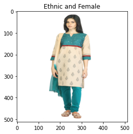

# Aim

To automate the process of labelling the clothing images as Ethnic/Western and Male/Female which were manually entered
while cataloging.

# Dataset Setup

I have provided the ```train.csv```, ```test.csv``` here itself and the image folder can be downloaded
from [Google Drive link to the image folder](https://drive.google.com/drive/folders/1ZUEp84BV6miIE1uI6UYKkQOPBQ7UpcTB?usp=sharing)
which can be produced by following the below-mentioned procedure.

- Place your Kaggle API Token at appropriate location based on your system.
- Then execute the below bash commands to download ```styles.csv``` and ```image.csv``` files which will help prepare
  dataset.

- ```shell
  #!/bin/bash
  kaggle datasets download paramaggarwal/fashion-product-images-dataset -f fashion-dataset/styles.csv
  kaggle datasets download paramaggarwal/fashion-product-images-dataset -f fashion-dataset/images.csv
  unzip styles.csv.zip
  unzip images.csv.zip
  rm styles.csv.zip
  rm images.csv.zip
  ```

[Link to the details of Dataset](https://www.kaggle.com/datasets/paramaggarwal/fashion-product-images-dataset)
I have used only certain part of this dataset for our purpose.

- Then run ```train.py``` it will prepare ```train.csv```, ```test.csv``` and images into ```images``` folder if they
  don't exist.
- Run ```utils.py``` if you only need to get ```train.csv```, ```test.csv``` and images into ```images``` folder without
  starting the training process.

# Training

- ```shell
  #!/bin/bash
  python train.py
  python test.py
  ```

    - ```Multi Label Classification Problem``` where the desired class can be more than one among the possible classes.

- I have used single pretrained ```AlexNet``` model for this task. It's a primitive model as compared to various advance
  models consisting of attention, transformers, ELMs, residual networks, etc. since with this itself I am getting very
  good Top 1 accuracy, so I used it only also by this the produced model is small thus will consume less resources and
  will produce quicker inferences.

- In the last classifier layer of AlexNet consisting of a fully connected layer I have changed number of classes to 4.
  **In the output the first 2 values correspond to Genre if 0th index is higher than 1st index then it's an Ethnic cloth
  and
  Western otherwise. If the 2nd index is higher than 3rd index then it's a Male clothing and Female clothing
  otherwise.**

- As it was multi label classification problem thus I have used ```MultiLabelMarginLoss``` as loss function

# Results

| Class  | Top 1 Accuracy |
|--------|----------------|
| Genre  | 94.6%          |
| Gender | 96.2%          |

|        | .jpeg)    |
|-----------------------------|--------------------------------|
| .jpeg) | .jpeg)    |
